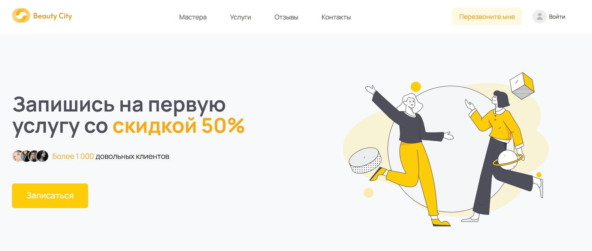

# BeautyCity



Сайт сети салонов красоты BeautyCity — онлайн-запись на процедуры без звонков и переписки с администратором.

Сейчас Ольга (владелица сети) обрабатывает все заявки на запись вручную через переписку в соцсетях — это отнимает время администратора и часть заявок теряется. Сайт автоматизирует запись: клиент сам выбирает салон, услугу, мастера и удобное время, а Ольга получает готовую запись в базе и статистику по посещениям без звонков.

Адрес сайта: [BeautyCity](https://beauty.kislyakov.pro/)

## Что умеет сайт

**Клиент:**
- Выбирает салон, услугу и мастера — либо по порядку через форму записи, либо сразу переходит к записи, кликнув на конкретного мастера/услугу/салон на главной странице
- Видит только тех мастеров, которые реально работают в выбранном салоне и делают выбранную услугу
- Выбирает свободное время по календарю — доступные слоты считаются на бэкенде с учётом расписания мастера и уже существующих записей, а не хардкожены
- Входит в личный кабинет по номеру телефона и SMS-коду, без пароля
- Видит свои записи (предстоящие и прошедшие) в личном кабинете
- Оплачивает запись онлайн через ЮKassa
- Оставляет заявку "Перезвоните мне", если не хочет разбираться с формой

**Администратор/персонал:**
- Отдельная панель статистики (сумма оплат за месяц, количество посещений, посещаемость) вместо личного кабинета клиента
- Видит все записи и заявки на звонок через стандартную Django-админку

## ⚙️ Технический стек

- **Бэкенд**: Python 3.13, Django 6.0, Django REST Framework
- **База данных**: SQLite (локально)
- **Фронтенд**: Django Templates + jQuery, данные подгружаются через собственный JSON API (без SPA-фреймворка)
- **Платежи**: ЮKassa (yookassa-python)
- **Библиотеки вёрстки**: Slick Carousel, Air Datepicker, Arctic Modal

## 📂 Структура проекта

```text
.
├── apps/
│   ├── core/                      # вся бизнес-логика проекта
│   │   ├── models.py              # Salon, Procedure, Specialist, Booking и т.д.
│   │   ├── views.py                # API-эндпоинты + рендер страниц
│   │   ├── serializers.py         # сериализаторы DRF
│   │   ├── forms.py               # формы (BookingForm)
│   │   ├── slots.py               # расчёт свободных слотов времени мастера
│   │   ├── phone_auth.py          # вход по SMS-коду
│   │   ├── payment_views.py       # интеграция с ЮKassa
│   │   ├── callback_views.py      # заявки "Перезвоните мне"
│   │   ├── admin.py
│   │   ├── urls.py
│   │   └── management/commands/   # seed_db, generate_shifts и др.
│   └── beauty_city/                # настройки проекта (settings, urls, wsgi)
├── static/                         # css, js, img (вёрстка)
├── templates/                      # HTML-шаблоны + templates/partials/ (переиспользуемые блоки)
├── manage.py
└── requirements.txt
```

## 🛠️ Установка и настройка

#### 1. Клонируйте репозиторий:
```bash
git clone https://github.com/<ваш-репозиторий>/BeautyCity.git
cd BeautyCity
```

#### 2. Создайте и активируйте виртуальное окружение:
```bash
python -m venv .venv
.venv\Scripts\activate   # на Windows
source .venv/bin/activate   # на Linux / macOS
```

#### 3. Установите зависимости:
```bash
pip install -r requirements.txt
```

#### 4. Настройте переменные окружения. Создайте файл `.env` в корне проекта:
```dotenv
DJANGO_SECRET_KEY=django-insecure-замени-меня
DJANGO_DEBUG=True
DJANGO_ALLOWED_HOSTS=127.0.0.1,localhost

# ЮKassa — тестовые ключи из личного кабинета yookassa.ru (тестовый режим)
YOOKASSA_SHOP_ID=
YOOKASSA_SECRET_KEY=
SITE_URL=http://127.0.0.1:8000
```
Без ключей ЮKassa сайт полностью работает — не работает только кнопка "Оплатить".

#### 5. Примените миграции и создайте суперпользователя:
```bash
python manage.py migrate
python manage.py createsuperuser
```

#### 6. Заполните базу демо-данными:
```bash
python manage.py seed_db
```
Команда создаёт салоны, услуги, мастеров с привязкой к конкретным салонам/услугам и цены по салонам — сразу в правильном виде, без ручной сборки через админку.

#### 7. Сгенерируйте рабочие смены мастеров на ближайшие 30 дней (нужно, чтобы форма записи показывала свободное время):
```bash
python manage.py generate_shifts
```

#### 8. Запустите сервер:
```bash
python manage.py runserver
```
Откройте [http://127.0.0.1:8000/](http://127.0.0.1:8000/).

## 🔑 Вход в личный кабинет

Вход клиента — по номеру телефона и SMS-коду. В деве вместо реальной отправки SMS код печатается в консоль сервера при запросе кода (тестовый код-заглушка: `1234`).

Чтобы попасть в панель статистики персонала (`/dashboard/`), пользователь должен быть `is_staff` — выставляется через `/admin/` или флагом при `createsuperuser`.

## 🚀 Workflow

#### 1. Актуальность: перед началом работы подтяните свежие изменения из `main`:
```bash
git checkout main
git pull origin main
```

#### 2. Разработка: под каждую задачу — отдельная ветка:
```bash
git checkout -b feature/<имя-задачи>
```

#### 3. Коммит и пуш:
```bash
git add .
git commit -m "что сделано"
git push -u origin feature/<имя-задачи>
```

#### 4. Мердж — через Pull Request на GitHub, не напрямую в `main`.

#### 5. После мерджа — удалите локальную ветку:
```bash
git checkout main
git pull origin main
git branch -d feature/<имя-задачи>
```

## Цели проекта

Учебный командный проект: сайт для сети салонов красоты с онлайн-записью, личным кабинетом клиента и панелью статистики администратора.